# Курс: Информационные технологии и веб-разработка в образовании

**Аудитория:** Студенты IV курса педагогического направления, профиль IT

**Длительность курса:** 1 семестр, 54 академических часа

**Исполнил:** Антипов Арсений Павлович, ИВТ 1.2, 4 курс

## Цели обучения

1. Освоить современные веб-технологии для создания интерактивных образовательных материалов.
2. Научиться обрабатывать и визуализировать данные в контексте педагогики.
3. Приобрести навыки автоматизации рутинных образовательных процессов.
4. Применять полученные знания для разработки практических инструментов, поддерживающих учебный процесс.

## Приобретённые компетенции

После окончания курса студенты смогут:

- Разрабатывать интерактивные веб-приложения для учебных целей.
- Анализировать и визуализировать данные об успеваемости студентов.
- Автоматизировать подготовку отчётов и учебной документации.
- Внедрять современные IT-решения в образовательный процесс.
- Создавать электронные образовательные ресурсы.

## Структура курса

### Модуль 1: Веб-технологии и интерактивное образование (18 часов)

- **Лекция 1:** Основы HTML5 и CSS3 для подготовки учебных материалов.
- **Лекция 2:** JavaScript и добавление интерактивности на страницы.
- **Лекция 3:** Разработка образовательных веб-приложений с помощью фреймворков.
- **Практическая работа 1:** Создание интерактивной учебной страницы.

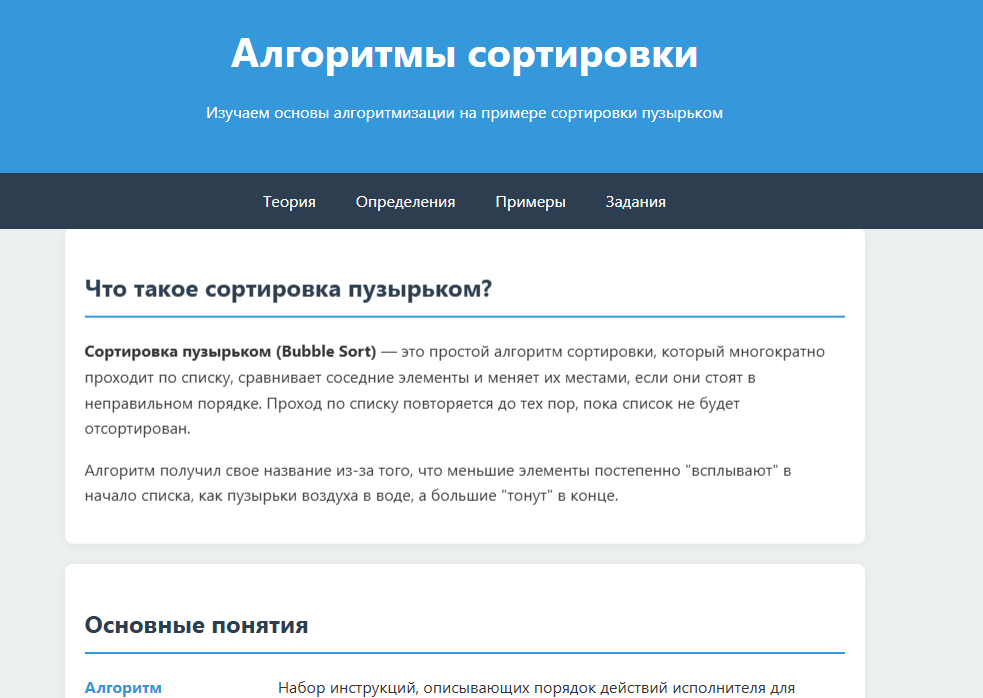
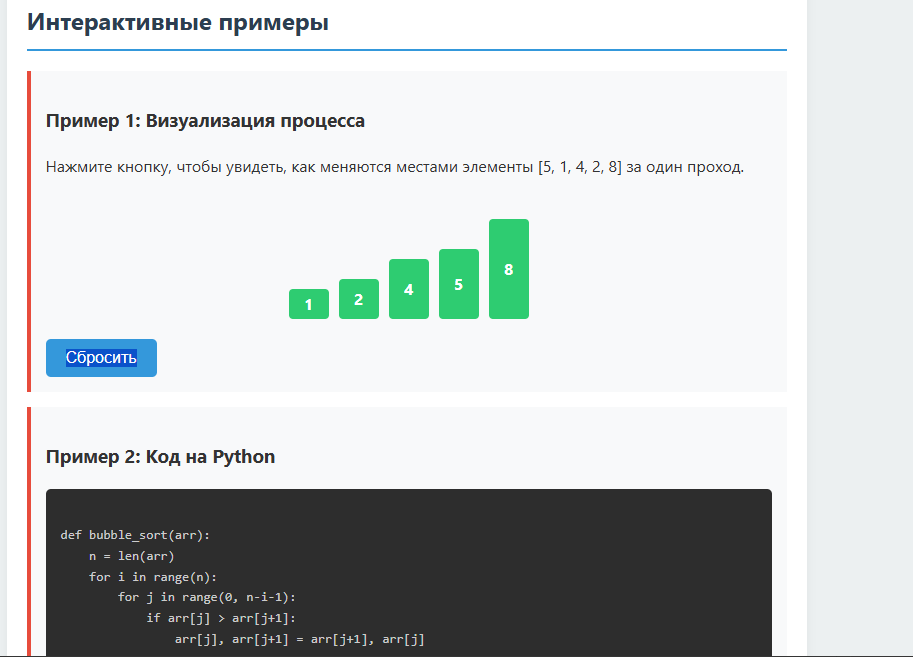
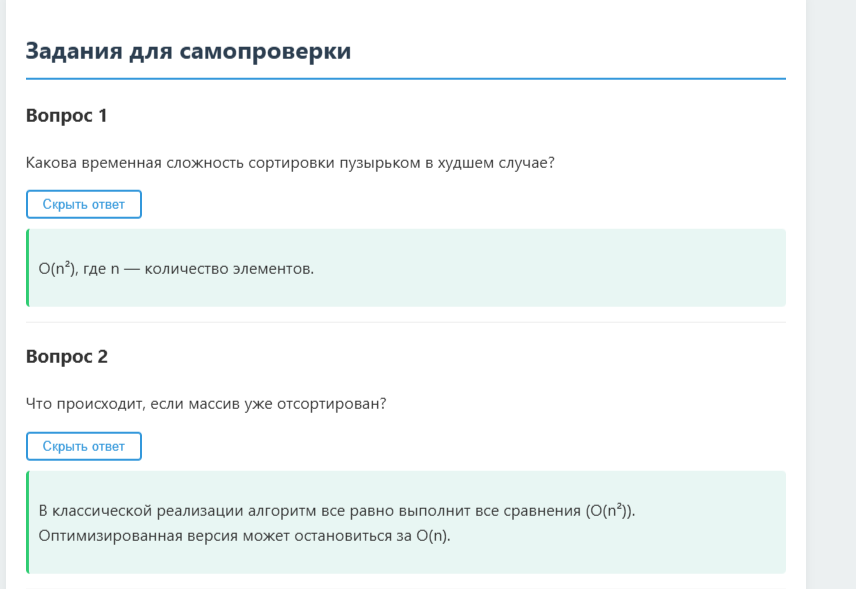

- **Практическая работа 2:** Разработка онлайн-теста с автоматической проверкой.

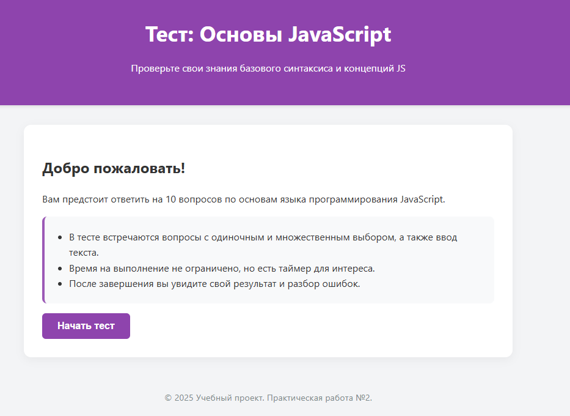
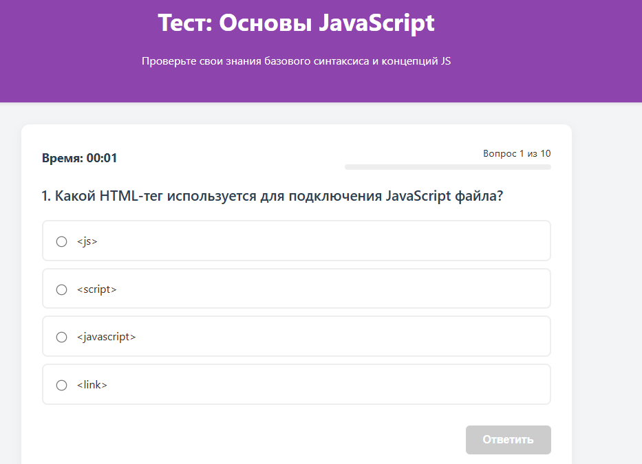
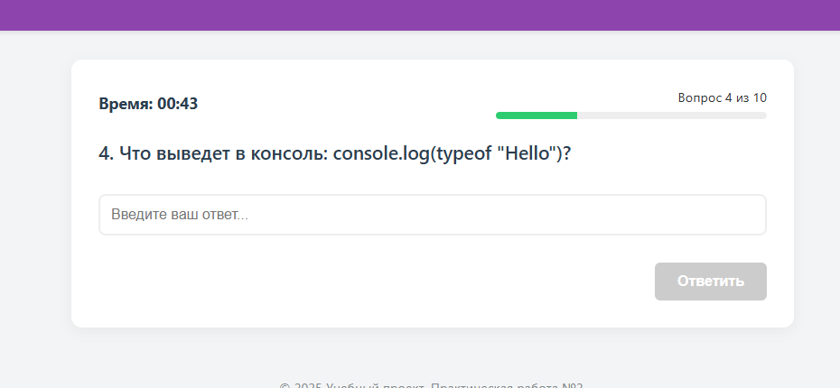

- **Практическая работа 3:** Создание образовательной веб-игры.

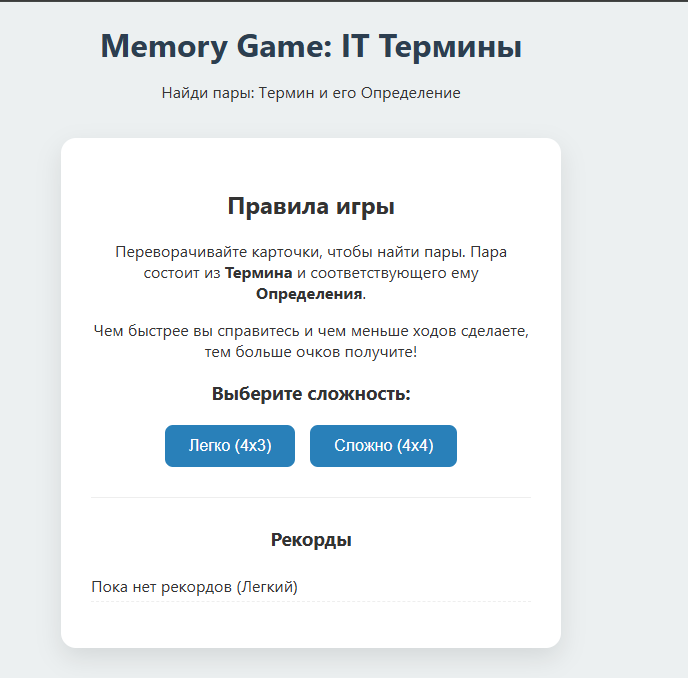
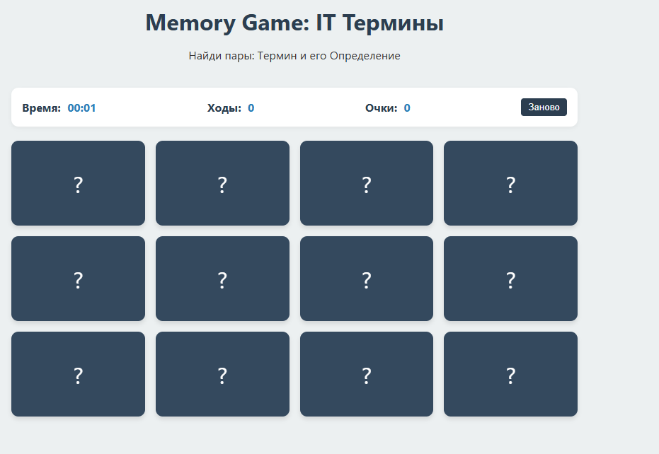
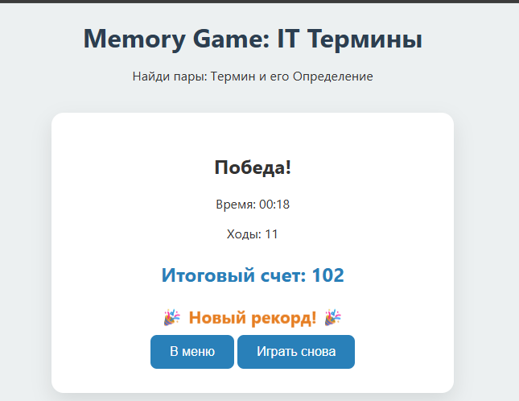

### Модуль 2: Работа с образовательными данными (18 часов)

- **Лекция 1:** Основы анализа данных на Python для учебных целей.
- **Лекция 2:** Визуализация данных для мониторинга успеваемости.
- **Лекция 3:** Статистическая обработка оценок студентов.
- **Практическая работа 1:** Анализ журнала успеваемости и вычисление ключевых показателей.

```text
================================================================================
ОТЧЁТ ОБ УСПЕВАЕМОСТИ КЛАССА
Дата формирования: 05.12.2025 18:36
================================================================================

Общая информация
--------------------------------------------------------------------------------
Количество студентов: 10
Средний балл: 4.12
Медиана оценок: 4.20
Стандартное отклонение: 0.66
Минимальная оценка: 3.00
Максимальная оценка: 5.00

Категории успеваемости
--------------------------------------------------------------------------------
Отличники: 4 (40%)
Хорошисты: 4 (40%)
Троечники: 2 (20%)
Требуют внимания: 0 (0%)

Детальная статистика по предметам
--------------------------------------------------------------------------------

Математика:
  Средняя оценка: 4.10
  Медиана: 4.00
  Отклонение: 0.88
  Мин/Макс: 3 / 5

Русский язык:
  Средняя оценка: 4.10
  Медиана: 4.00
  Отклонение: 0.74
  Мин/Макс: 3 / 5

Физика:
  Средняя оценка: 4.00
  Медиана: 4.00
  Отклонение: 0.82
  Мин/Макс: 3 / 5

Информатика:
  Средняя оценка: 4.40
  Медиана: 4.50
  Отклонение: 0.70
  Мин/Макс: 3 / 5

История:
  Средняя оценка: 4.00
  Медиана: 4.00
  Отклонение: 0.82
  Мин/Макс: 3 / 5

================================================================================
ТОП-5 САМЫХ УСПЕШНЫХ СТУДЕНТОВ
--------------------------------------------------------------------------------
1. Козлова А.В.: 5.00 (Отличник)
2. Новикова Е.П.: 4.80 (Отличник)
3. Иванов И.И.: 4.60 (Отличник)
4. Соколов В.П.: 4.60 (Отличник)
5. Петрова М.А.: 4.40 (Хорошист)

================================================================================
⚠️  Студенты, требующие внимания
--------------------------------------------------------------------------------
  • Сидоров П.С.: 3.40
  • Фёдоров А.Н.: 3.00

================================================================================
Конец отчёта
================================================================================
```

- **Практическая работа 2:** Построение дашборда для контроля успеваемости.


- **Практическая работа 3:** Анализ результатов тестов и формирование подробных отчётов.

```text
================================================================================
АНАЛИТИЧЕСКИЙ ОТЧЁТ ПО РЕЗУЛЬТАТАМ КОНТРОЛЬНОЙ
Дата формирования: 05.12.2025 18:45
================================================================================

1. Общие показатели
--------------------------------------------------------------------------------
Количество студентов: 25
Количество заданий: 15
Средний результат: 62.9%
Медиана: 60%
Лучший результат: 80%
Худший результат: 46.7%

Распределение оценок:
  Отлично (≥85%): 0 студентов (0%)
  Хорошо (70–84%): 8 студентов (32%)
  Удовлетворительно (50–69%): 14 студентов (56%)
  Ниже 50%: 3 студента (12%)

2. Проблемные задания (успеваемость <60%)
--------------------------------------------------------------------------------
Задание 6:
  Тема: Теорема Пифагора
  Выполнили правильно: 14/25 (56%)
  Сложность: Средняя

Задание 9:
  Тема: Тригонометрия
  Выполнили правильно: 14/25 (56%)
  Сложность: Средняя

Задание 12:
  Тема: Логарифмы
  Выполнили правильно: 10/25 (40%)
  Сложность: Высокая

Задание 13:
  Тема: Производная
  Выполнили правильно: 10/25 (40%)
  Сложность: Высокая

Задание 14:
  Тема: Производная
  Выполнили правильно: 9/25 (36%)
  Сложность: Высокая

Задание 15:
  Тема: Производная
  Выполнили правильно: 11/25 (44%)
  Сложность: Высокая

3. Анализ тем
--------------------------------------------------------------------------------
Темы, требующие дополнительной проработки:
  - Производная: 40%
  - Логарифмы: 59%

4. Студенты, нуждающиеся в поддержке (результат <50%)
--------------------------------------------------------------------------------
  Студент 7: 46.7%
  Студент 19: 46.7%
  Студент 20: 46.7%

5. Рекомендации
--------------------------------------------------------------------------------
📚 Провести дополнительные занятия по темам:
   - Производная
   - Логарифмы

👥 Организовать консультации для 3 студентов

================================================================================
Конец отчёта
================================================================================
```

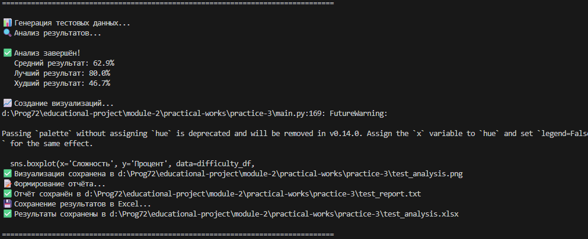
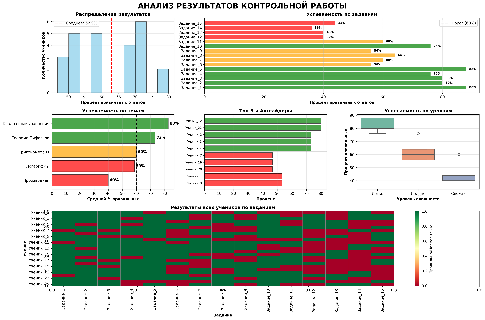

### Модуль 3: Автоматизация педагогических процессов (18 часов)
- Лекция 1: Методы автоматизации работы с образовательной документацией
- Лекция 2: Разработка ботов для образовательных платформ
- Лекция 3: Интеграция различных образовательных сервисов
- Практическая работа 1: Генерация заданий и тестов в автоматическом режиме
- Практическая работа 2: Создание Telegram-бота для взаимодействия с учащимися
- Практическая работа 3: Система автоматических уведомлений для родителей

## Методика преподавания

- **Лекции:** Демонстрация теории с практическими примерами
- **Практические работы:** Реализация мини-проектов с использованием изученных технологий
- **Форматы занятий:** Индивидуальная и групповая работа
- **Оценка:** Защита практических заданий и итогового проекта

## Входные требования

- Базовые знания программирования (Python или JavaScript)
- Навыки работы с компьютером и интернетом
- Основы HTML/CSS

## Технические требования

- ПК с доступом в интернет
- Установленные Python 3.8+, Node.js, редактор кода (VS Code)
- Браузер (Chrome, Firefox)
- Git для контроля версий