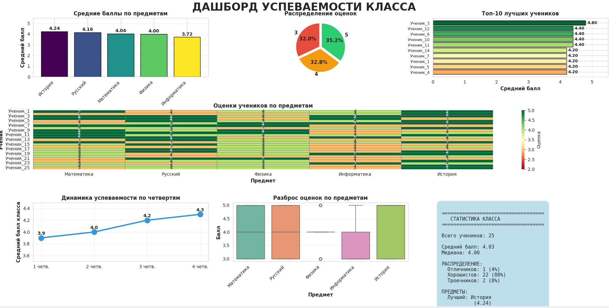

# Модуль 2: Работа с данными в образовательном процессе

**Продолжительность:** 18 академических часов (6 часов лекций + 12 часов практики)

## Цель модуля

Освоить методы сбора, обработки, анализа и визуализации данных в образовательном контексте с использованием Python. Научиться применять инструменты data science для улучшения образовательного процесса и принятия обоснованных решений.

## Задачи модуля

1. Изучить основы работы с данными в Python (pandas, numpy)
2. Освоить инструменты визуализации данных (matplotlib, seaborn)
3. Применить статистические методы для анализа успеваемости
4. Создать практические инструменты для работы учителя

## Планируемые результаты обучения

После завершения модуля студенты смогут:
- Загружать и обрабатывать данные из различных источников (Excel, CSV)
- Анализировать успеваемость учащихся с помощью статистических методов
- Создавать наглядные визуализации данных
- Автоматизировать формирование отчётов
- Выявлять закономерности и тренды в образовательных данных
- Разрабатывать дашборды для мониторинга успеваемости

## Содержание модуля

### Лекция 1: Основы работы с данными в Python (2 часа)
- Введение в pandas и numpy
- Чтение данных из файлов (Excel, CSV)
- Базовые операции с таблицами
- Фильтрация и сортировка данных
- Группировка и агрегация

### Лекция 2: Визуализация данных для образовательной аналитики (2 часа)
- Библиотеки matplotlib и seaborn
- Типы графиков и их применение
- Создание дашбордов
- Интерактивные визуализации
- Best practices визуализации

### Лекция 3: Статистический анализ успеваемости учащихся (2 часа)
- Описательная статистика
- Корреляционный анализ
- Выявление трендов
- Прогнозирование успеваемости
- A/B тестирование в образовании

### Практическая работа 1: Обработка журнала успеваемости (4 часа)
Загрузка данных журнала, расчёт средних баллов, определение отстающих и успевающих учеников

```================================================================================
ОТЧЁТ ПО УСПЕВАЕМОСТИ КЛАССА
Дата: 05.12.2025 18:36
================================================================================

ОБЩАЯ СТАТИСТИКА КЛАССА
--------------------------------------------------------------------------------
Всего учеников: 10
Средний балл класса: 4.12
Медиана: 4.20
Стандартное отклонение: 0.66
Минимальный балл: 3.00
Максимальный балл: 5.00

РАСПРЕДЕЛЕНИЕ УЧЕНИКОВ
--------------------------------------------------------------------------------
Отличников: 4 (40.0%)
Хорошистов: 4 (40.0%)
Троечников: 2 (20.0%)
Требуют внимания: 0 (0.0%)

СТАТИСТИКА ПО ПРЕДМЕТАМ
--------------------------------------------------------------------------------

Математика:
  Средний балл: 4.10
  Медиана: 4.00
  Стд. отклонение: 0.88
  Мин/Макс: 3 / 5

Русский:
  Средний балл: 4.10
  Медиана: 4.00
  Стд. отклонение: 0.74
  Мин/Макс: 3 / 5

Физика:
  Средний балл: 4.00
  Медиана: 4.00
  Стд. отклонение: 0.82
  Мин/Макс: 3 / 5

Информатика:
  Средний балл: 4.40
  Медиана: 4.50
  Стд. отклонение: 0.70
  Мин/Макс: 3 / 5

История:
  Средний балл: 4.00
  Медиана: 4.00
  Стд. отклонение: 0.82
  Мин/Макс: 3 / 5

================================================================================
ТОП-5 ЛУЧШИХ УЧЕНИКОВ
--------------------------------------------------------------------------------
1. Козлова А.В.: 5.00 (Отличник)
2. Новикова Е.П.: 4.80 (Отличник)
3. Иванов И.И.: 4.60 (Отличник)
4. Соколов В.П.: 4.60 (Отличник)
5. Петрова М.А.: 4.40 (Хорошист)

================================================================================
⚠️  УЧЕНИКИ, ТРЕБУЮЩИЕ ВНИМАНИЯ
--------------------------------------------------------------------------------
  • Сидоров П.С.: 3.40
  • Фёдоров А.Н.: 3.00

================================================================================
Конец отчёта
================================================================================
```

### Практическая работа 2: Создание дашборда для мониторинга успеваемости (4 часа)
Разработка интерактивного дашборда с графиками и статистикой класса



### Практическая работа 3: Анализ результатов тестирования и формирование отчётов (4 часа)
Анализ результатов контрольных работ, выявление проблемных тем, автоматическое создание отчётов

## Используемые технологии

- **Python 3.8+** - язык программирования
- **pandas** - работа с табличными данными
- **numpy** - численные вычисления
- **matplotlib** - создание графиков
- **seaborn** - статистическая визуализация
- **Jupyter Notebook** - интерактивная разработка
- **openpyxl** - работа с Excel файлами

## Структура данных для работы

Во время модуля мы будем работать с типичными образовательными данными:

- **Журнал успеваемости**: ФИО, предмет, оценки, посещаемость
- **Результаты тестов**: вопросы, правильные/неправильные ответы
- **Контрольные работы**: баллы по заданиям, итоговые оценки
- **Статистика класса**: средние баллы, динамика по четвертям

## Рекомендуемая литература

1. "Python для анализа данных" - Уэс Маккинни
2. "Визуализация данных" - Кирилл Еременко
3. "Статистика для чайников" - Дебора Рамси
4. Документация pandas: https://pandas.pydata.org/
5. Документация matplotlib: https://matplotlib.org/

## Критерии оценивания практических работ

- **Отлично (5):** Работа выполнена полностью, код чистый, результаты корректны, есть дополнительный анализ
- **Хорошо (4):** Работа выполнена, есть небольшие недочёты в коде или анализе
- **Удовлетворительно (3):** Базовая функциональность реализована, но есть существенные недостатки
- **Неудовлетворительно (2):** Работа не выполнена или не работает

## Установка необходимых библиотек

```bash
# Создание виртуального окружения (рекомендуется)
python -m venv venv
source venv/bin/activate  # Linux/Mac
venv\Scripts\activate     # Windows

# Установка библиотек
pip install pandas numpy matplotlib seaborn jupyter openpyxl
```

## Запуск Jupyter Notebook

```bash
jupyter notebook
```

Откроется браузер с интерфейсом Jupyter, где можно создавать и запускать Python-скрипты интерактивно.

## Примеры применения в педагогической практике

1. **Мониторинг успеваемости** - отслеживание динамики оценок учеников
2. **Выявление отстающих** - автоматическое определение учеников, нуждающихся в помощи
3. **Анализ сложности заданий** - какие темы вызывают наибольшие трудности
4. **Отчёты для родителей** - автоматическая генерация наглядных отчётов
5. **Планирование учебного процесса** - на основе данных предыдущих лет
6. **Оценка эффективности методик** - сравнение результатов разных групп

## Этические аспекты работы с образовательными данными

⚠️ **Важно помнить:**
- Конфиденциальность данных учащихся
- Согласие родителей на обработку данных
- Анонимизация при необходимости
- Безопасное хранение данных
- Использование только в образовательных целях

